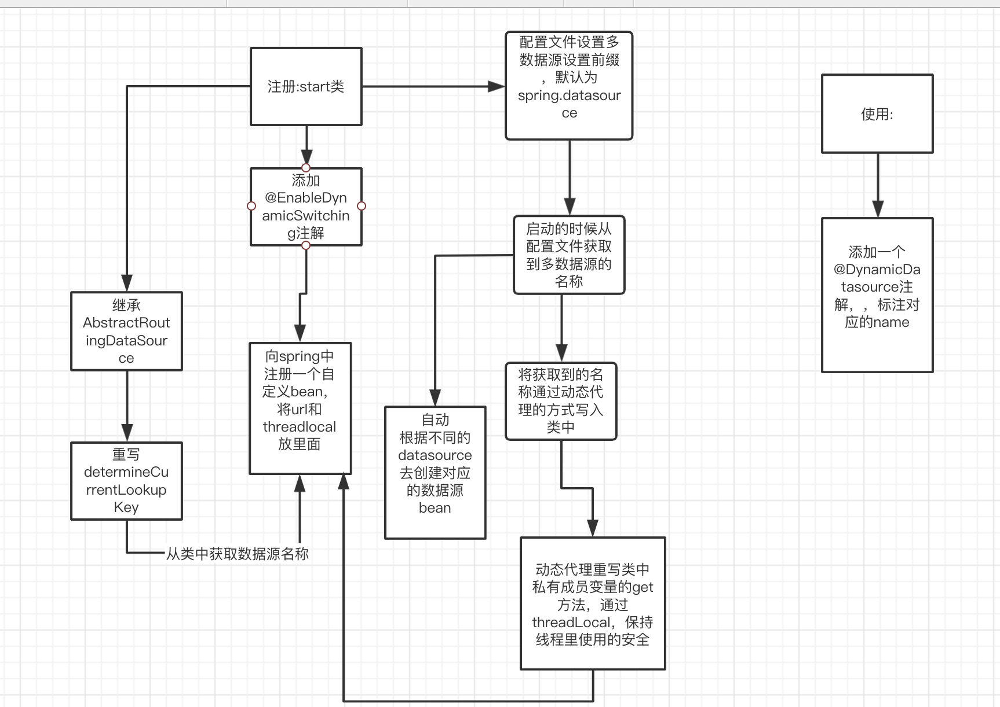

# proxys
java 代理模式进行数据源的切换

##  代理实现目的
现在项目上实现的是多数据源的情况，但是当我的数据源比较多的时候，我每实现一个数据源就要写一个config去配置，但是我并不想这么配置，我想的是能不能够当我使用同一个config的情况下，在配置文件中配置了不同的数据源的时候，~~使用不同的数据源的时候能不能根据dao层路径实现动态数据源的切换呢~~ 使用注解的形式用代理进行自动切换

## TODO
将当前切换的模式改成cglib的模式进行切换

## 流程图

